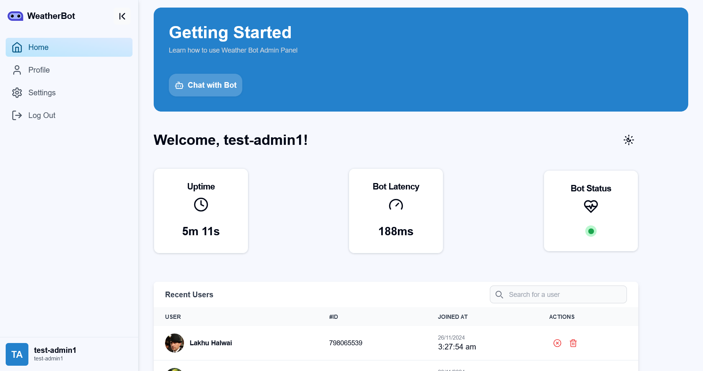
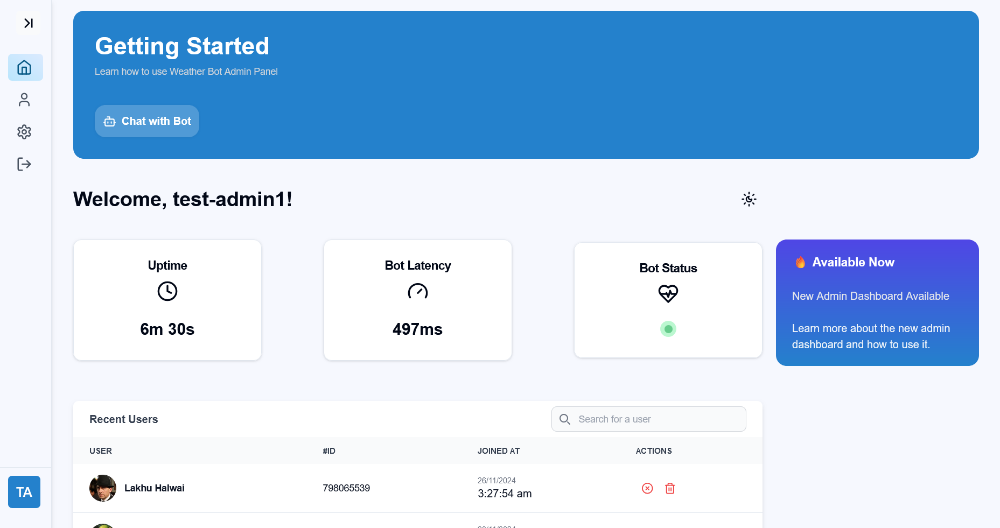
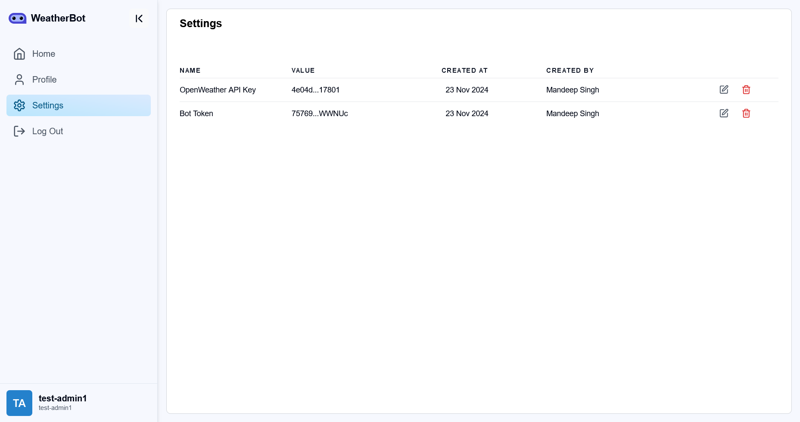
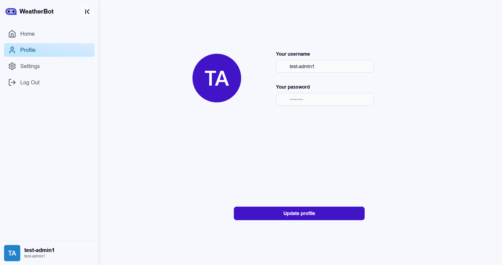
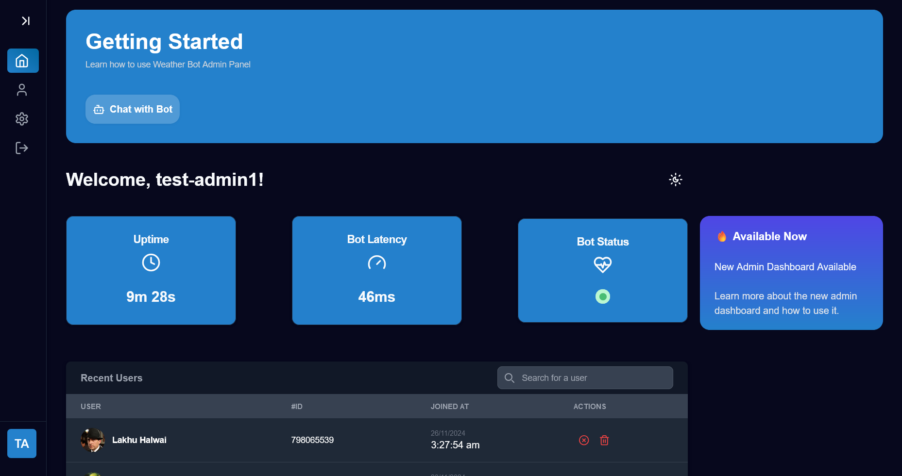

# 🌦️ WeatherBot Admin Panel

The **WeatherBot Admin Panel** is a web-based interface built with modern technologies to manage and monitor the Telegram bot users and their interactions. It allows administrators to validate and update user data, monitor banned users, and streamline the overall functionality of the bot.

Designed for simplicity and efficiency, the panel leverages **React**, **Vite**, **TypeScript**, and **Tailwind CSS** for a fast, scalable, and responsive user experience.

---

## Features

### Admin Panel Features

- **User Management**
  - View all registered bot users.
  - Manage banned users by banning or unbanning them directly from the panel.

- **Real-Time Data Updates**
  - Displays user data fetched from the backend in real-time.
  - Updates the UI instantly when changes are made.

- **Responsive Design**
  - Ensures seamless functionality across all devices with Tailwind CSS.

- **Type-Safe Codebase**
  - Built with TypeScript to provide robust type checking and minimize runtime errors.

- **Integration with Backend**
  - Communicates with the bot server for data handling using Axios.

---

## Table of Contents

- [Features](#features)
- [Technologies Used](#technologies-used)
- [Screenshots](#screenshots)
- [Getting Started](#getting-started)
  - [Prerequisites](#prerequisites)
  - [Installation](#installation)
  - [Running the Application](#running-the-application)
- [Environment Variables](#environment-variables)
- [Components Overview](#components-overview)
- [License](#license)

---

## Technologies Used

- **React**: Frontend framework for building user interfaces.
- **Vite**: Fast development build tool for React.
- **TypeScript**: Enhances the codebase with static typing.
- **Tailwind CSS**: Utility-first CSS framework for responsive and modern designs.
- **Axios**: Simplifies HTTP requests for fetching and managing data.

---

## Screenshots

| Admin Panel Screenshot |
|:------------------------:|
|  |
| Home Page with Closed Sidebar |
|  |
| Settings Page |
|  |
| Profile Page |
|  |
| Dark Mode |
|  |

---

## Getting Started

### Prerequisites

- [Node.js](https://nodejs.org/) (v14 or above)
- [npm](https://www.npmjs.com/) or [yarn](https://yarnpkg.com/)
- Backend server for the WeatherBot ([WeatherBot Server Repo](https://github.com/deepsingh132/weatherbot))

---

### Installation

1. Clone the repository:

   ```bash
   git clone https://github.com/deepsingh132/weatherbot-admin-panel.git
   cd weatherbot-admin-panel
   ```

2. Install dependencies:

   ```bash
   npm install
   ```

3. Configure environment variables:
   Create a `.env` file in the root directory (see [Environment Variables](#environment-variables)).

4. Start the development server:

   ```bash
   npm run dev
   ```

---

## Environment Variables

Add the following to a `.env` file in the root directory:

```env
VITE_BACKEND_URL=http://localhost:5000
```

---

## Components Overview

### UserTable

A dynamic table component to display user data with features like:

- Pagination
- Action buttons for banning/unbanning users.

### Responsive and Intuitive Sidebar

A responsive and intuitive sidebar for navigation and user interactions.

### Modal

Reusable modal for confirming critical actions (e.g., editing api keys or banning users).

---

## License

This project is licensed under the GPL v3 License. See the [LICENSE](LICENSE) file for details.

---

## Author

Developed with ❤️ by **Mandeep Singh**

- [LinkedIn](https://linkedin.com/in/deepsingh132)
- [GitHub](https://github.com/deepsingh132)
